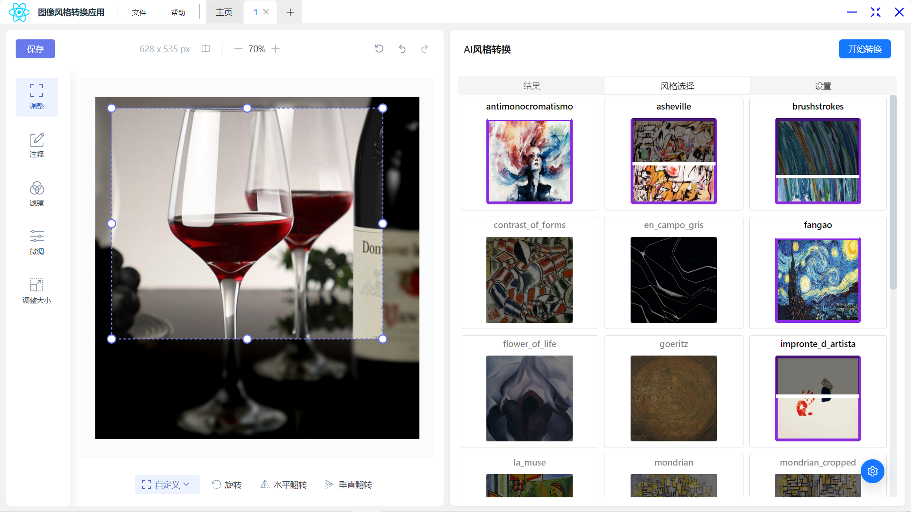
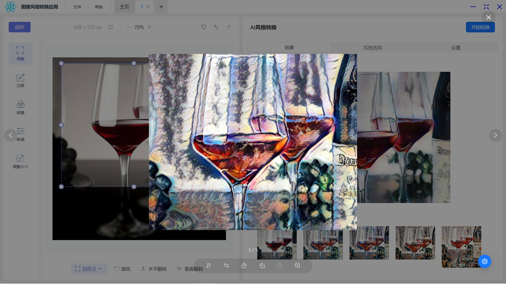
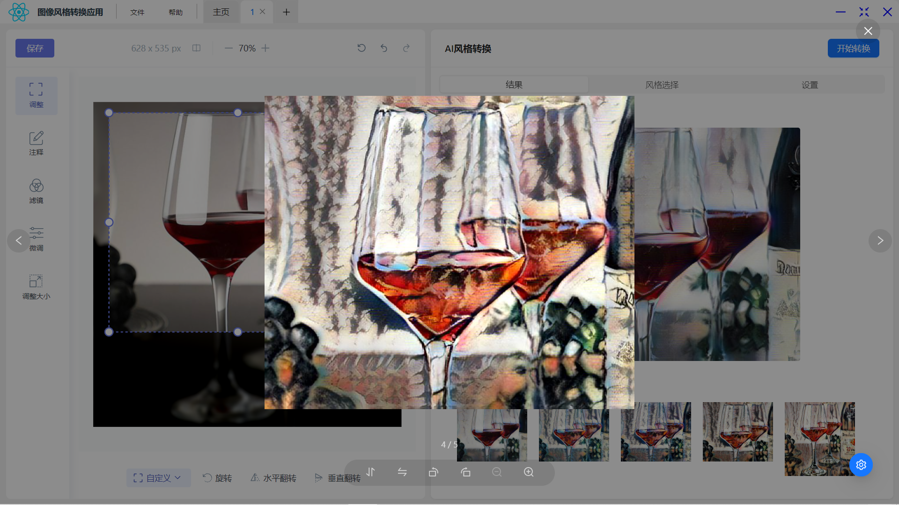
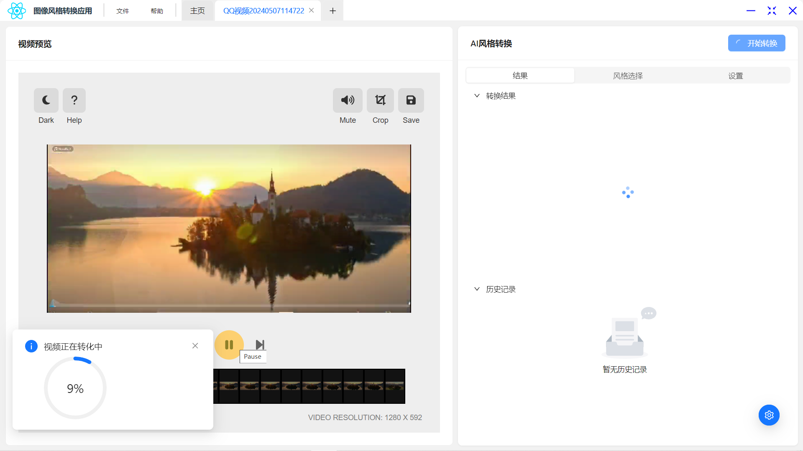
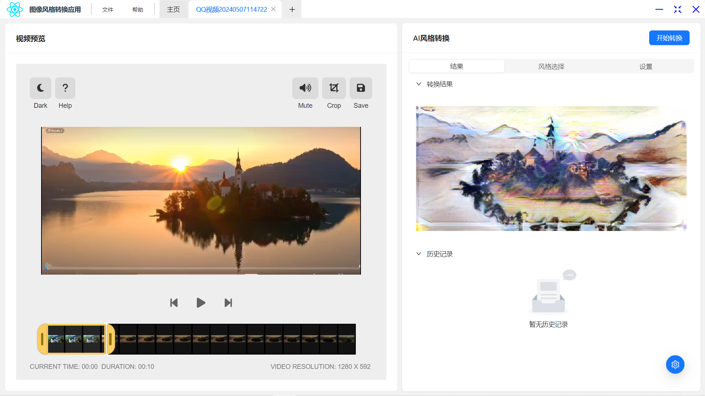

# 界面及功能
#### 主界面
* 记录最近打开的文件
* 多种文件支持，图片、视频、本地摄像头


### 编辑界面

* 提供图片编辑界面，基本的图片大小调整，图片拼接，滤镜及亮度等等微调
* 提供多种风格自由选择，同时能进行多风格的融合，自由选择各种风格占比



* 结果对比查看，每次都能设计出不一样的图片






### 视频编辑

* 对视频进行缩放剪裁，快速剪辑视频。
* 同上述风格选择进行转换，






## Get started

electron

```
git clone https://github.com/wxb-gs/image_style_transfer_electron.git
pnpm i
npm run dev
```
